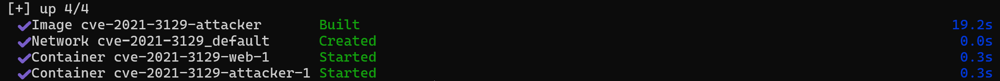
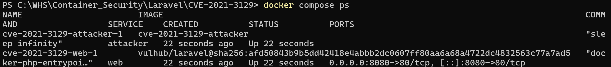
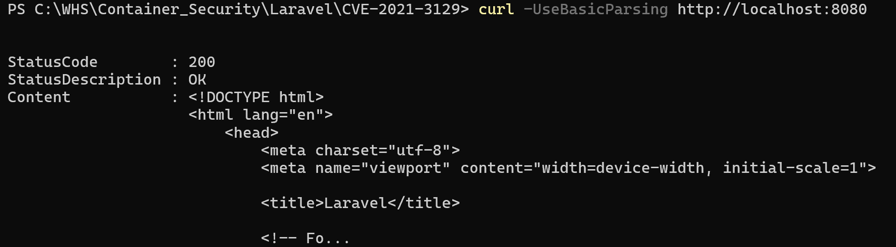
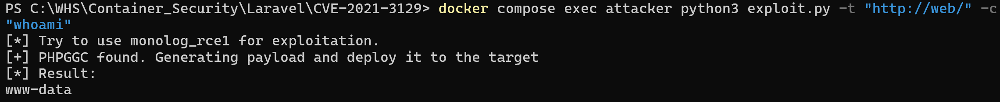

# Laravel Ignition RCE (CVE-2021-3129)

> 화이트햇 스쿨 1기 - 남현재 ([@npresent2926](https://github.com/npresent2926))

## 요약
- **대상**: Laravel (Ignition 패키지 포함), 버전 8.4.2 이하 (Ignition 2.5.2 미만)
- **CVSS**: 9.8 (Critical)
- **취약점 유형**: 인증되지 않은 원격 코드 실행 (Insecure Deserialization via PHAR)

## 취약 조건
- Laravel의 `APP_DEBUG=true` (디버그 모드 활성화)
- Ignition 버전 2.5.2 미만
- `/_ignition/execute-solution` 엔드포인트에 인증 없이 접근 가능

## 핵심 문제점 분석
Ignition의 `MakeViewVariableOptionalSolution` 클래스는 사용자 입력값(`viewFile`
파라미터)을 검증 없이 `file_get_contents()` / `file_put_contents()`에 그대로
전달한다. PHP의 스트림 래퍼(`php://filter`, `phar://`)를 악용하면 다음 순서로
원격 코드 실행이 가능하다.

1. **로그 비우기**: `php://filter/write=...` 체인으로 `storage/logs/laravel.log`
   내용을 삭제해 깨끗한 상태를 만든다.
2. **더미 데이터 삽입**: 로그에 정상적인 한 줄 포맷을 생성한다.
3. **악성 페이로드 주입**: `phpggc`로 생성한 PHAR 역직렬화 페이로드(Monolog
   gadget chain)를 UTF-16 hex 인코딩 형태로 로그에 기록한다.
4. **디코딩**: 같은 스트림 필터 체인을 역방향으로 적용해, 로그 파일을 실제
   유효한 PHAR 바이너리로 변환한다.
5. **트리거**: `viewFile=phar://../storage/logs/laravel.log/test.txt`로
   요청하면 PHP가 이를 PHAR로 인식해 역직렬화 → 내부 페이로드 실행.
6. **결과 추출**: 명령 실행 전후에 삽입해둔 고유 구분자(delimiter) 사이의
   텍스트만 파싱해 실행 결과를 얻는다.

## 환경 구성
본 재현 환경은 컨테이너 2개로 구성된다.
- **web**: 취약한 Laravel 서버 (`vulhub/laravel`, sha256 digest 고정)
- **attacker**: 익스플로잇 실행에 필요한 도구(Python, PHP CLI, phpggc)가
  모두 포함된 공격자 컨테이너

두 컨테이너는 Compose가 자동 생성하는 내부 네트워크를 통해 서비스 이름(`web`)
으로 서로 통신한다. 호스트에는 Docker 외 별도 설치가 필요 없다.

**사전 요구사항**: Docker / Docker Compose

**기동**:
```bash
cd Laravel/CVE-2021-3129
docker compose up -d --build
```
→ `docker compose ps`로 `web`, `attacker` 컨테이너 2개 모두 `Up` 상태 확인
→ http://localhost:8080 접속 시 Laravel 기본 페이지 확인 (대상 서버 정상 기동 검증)

> **참고**: `web` 서비스는 `platform: linux/amd64`로 아키텍처를 명시하여,
> Apple Silicon(arm64) 등 호스트 CPU 아키텍처와 무관하게 Docker의 내장
> 에뮬레이션을 통해 동일하게 재현됩니다. (에뮬레이션 특성상 첫 기동·실행이
> 다소 느릴 수 있으나 결과는 동일합니다)

## 재현 절차
환경이 정상 기동된 상태에서, 다음 절차로 실제 공격을 재현한다.

```bash
# attacker 컨테이너 내부에서 익스플로잇 스크립트 실행
docker compose exec attacker python3 exploit.py -t "http://web/" -c "whoami"
```

내부적으로 스크립트는 다음을 순차 수행한다 (☞ "핵심 문제점 분석" 참고):
로그 초기화 → PHAR 페이로드 생성·주입 → 인코딩 변환 → `phar://` 트리거 →
결과 추출.

임의 명령을 다른 값으로 바꿔서도 재현 가능하다 (예: `-c "id"`, `-c "cat /etc/passwd"`).

## 실행 결과

**1) 대상 서버 + 공격 도구 컨테이너 빌드 및 실행**
`attacker` 이미지 빌드 성공, `web`·`attacker` 컨테이너 모두 정상 시작됨을 확인


**2) 컨테이너 상태 확인** — `web` 컨테이너 이미지 digest(`sha256:afd50843b9b5...`)가
`docker-compose.yml`에 고정한 값과 일치, `attacker` 컨테이너가 `sleep infinity`로
대기 상태 유지 중임을 확인


**3) Laravel 기본 페이지 접속 확인** — HTTP 200 OK, Laravel 기본 웰컴 페이지 반환


**4) 익스플로잇 실행 결과** — 인증 없이 `attacker` 컨테이너에서 `web` 컨테이너로
전송한 요청만으로 원격 명령이 실행되어 `www-data` 결과를 획득함


## 원본 스크립트 수정 사항
`exploit.py`는 [miko550/CVE-2021-3129](https://github.com/miko550/CVE-2021-3129)
(원 출처: [SNCKER/CVE-2021-3129](https://github.com/SNCKER/CVE-2021-3129))를
기반으로 하되, 다음을 수정하여 포함함:
- `os.system("rm payload.txt")` → `os.remove("payload.txt")`로 교체
  (원본 코드는 Unix 전용 `rm` 명령을 직접 호출함; Python 내장 함수로 교체해
  크로스플랫폼 호환성 확보)
- 익스플로잇 실행 환경 자체를 Docker 컨테이너(`attacker`)로 격리하여, 호스트
  운영체제(Windows/Linux/macOS)에 관계없이 동일하게 재현되도록 구성

`phpggc`([ambionics/phpggc](https://github.com/ambionics/phpggc))는 원래
40여 개 프레임워크(WordPress, Drupal, Symfony 등)의 가젯 체인을 포함하나,
본 PoC는 `monolog/rce1` 체인만 사용하므로 관련 없는 프레임워크 파일은
제거하고 필요한 최소 구성(`phpggc` 실행 스크립트, `lib/`, `gadgetchains/Monolog/`)
만 포함함.

## 대응 방안
1. **업그레이드**: Laravel 8.4.2 이상 / Ignition 2.5.2 이상으로 업데이트
2. **디버그 모드 비활성화**: 운영 환경에서 `.env`의 `APP_DEBUG=false` 설정
3. **엔드포인트 접근 차단**: 리버스 프록시/WAF에서 `/_ignition/*` 경로에
   대한 외부 접근을 차단
4. **로그 파일 권한 강화**: 애플리케이션 프로세스의 로그 파일 쓰기 권한을
   최소화하여 임의 콘텐츠 주입 자체를 어렵게 만듦

## PoC 코드
익스플로잇 전체 코드는 [`attacker/exploit.py`](./attacker/exploit.py)에 있으며,
PHAR 페이로드 생성 도구는 [`attacker/phpggc/`](./attacker/phpggc)에 포함되어 있다.
스크립트는 `-t`(대상 URL), `-c`(실행 명령) 인자를 받는다.

## 참고 자료
- https://www.ambionics.io/blog/laravel-debug-rce
- https://nvd.nist.gov/vuln/detail/CVE-2021-3129
- https://github.com/vulhub/vulhub/tree/master/laravel/CVE-2021-3129